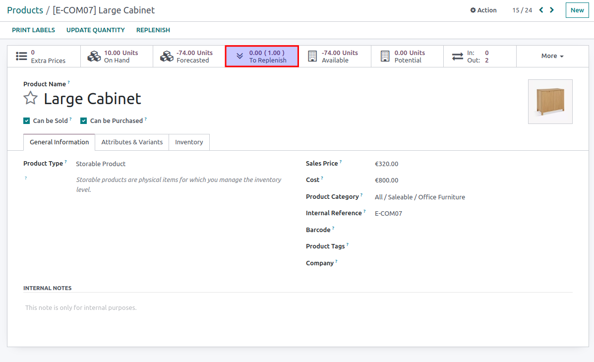

#. Go to Inventory > Products
#. On product form, the quantity to replenish is on top 'N.N (N.N) To Replenish'
#. The number between brackets is the quantity in replenishments
#. If you click on the button, you will see the movements that are to be done
   to fullfill the replenishment(s).

* These quantities are also displayed optionally on product list level and in
  product kanban.
